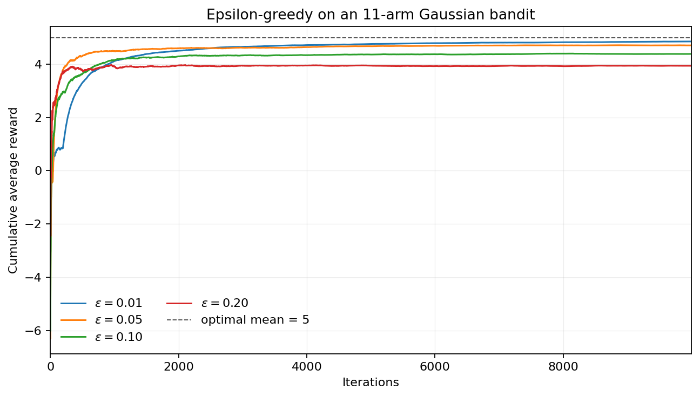

# HW1_1 实验报告

**题目：** ε-greedy 多臂老虎机与井字棋状态值学习
**日期：** 2026 Fall

## 1. 多臂老虎机：探索与利用

实验设置：11 个正态分布臂，均值为 −5 到 5，标准差均为 1，因此最优臂均值为 5。每个 ε 独立运行 10,000 次迭代，记录累计平均奖励。代码保留样例中的探索概率修正：实际探索概率为 `ε·11/10`。



| ε | 最终平均奖励 | 末 1000 次平均 | 现象 |
|---:|---:|---:|---|
| 0.01 | 4.8525 | 4.8456 | 最终最高，探索损失小 |
| 0.05 | 4.7066 | 4.7077 | 收敛较快且较稳定 |
| 0.10 | 4.3847 | 4.3832 | 探索噪声明显 |
| 0.20 | 3.9399 | 3.9408 | 平台最低，持续探索损失较大 |

四条曲线都从较低值快速上升，说明按各臂样本均值进行更新能够逐渐识别高均值臂。ε 较小时，后期主要利用当前最优估计，平台最高；ε 较大时，概率持续分配给较差臂，稳态平均奖励降低。早期曲线有波动是有限样本与随机探索造成的，单次交叉不代表稳定排序。因此，ε 体现了探索与利用的折中，不能只追求更大的探索率。

## 2. 井字棋：针对固定 O 的状态值学习

我方 X 先手，对手 O 始终选择当前棋盘的第一个空位。训练时对经过的状态使用蒙特卡洛状态值更新：

```text
V(S) ← V(S) + α [G − V(S)]
```

其中 X 获胜时 `G=1`，O 获胜时 `G=-1`，和棋时 `G=0`。训练参数为 120,000 局、训练探索率 ε=0.25、学习率 α=0.08，共学得 374 个状态。训练结束后，X 选择使后继状态价值 `V(S′)` 最大的动作；O 分支保持默认的第一个空位策略不变。

**运行结果：** 验证对局和最终 `verbose=true` 对局均由 X 获胜，最后一手完成一列三连。完整终端输出截图见 [`tictactoe_result.png`](tictactoe_result.png)。这说明针对固定对手的确定性偏好，状态值表可以学习出稳定且有效的对策，而不必对任意对手进行极大极小搜索。
