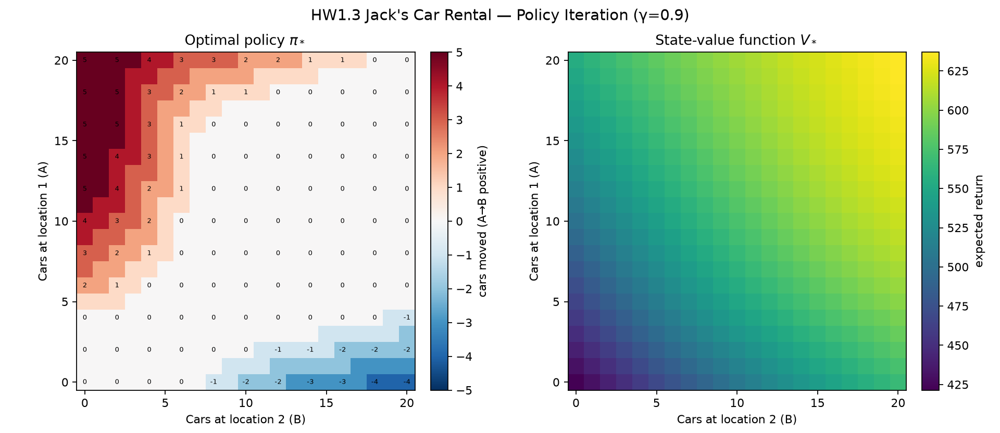
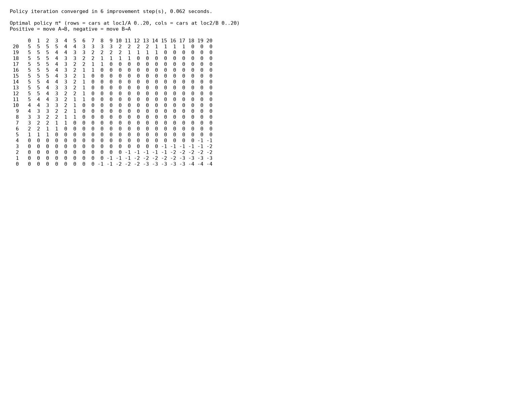

# HW1_3 实验报告

**题目：** Jack's Car Rental（Sutton & Barto P81，Figure 4.2）
**日期：** 2026 Fall

## 方法：策略迭代（Policy Iteration）

按书中 Example 4.2 / Figure 4.2 设定实现动态规划策略迭代，不调用采样环境：

- 状态：两地隔夜车辆数 \((n_1, n_2)\)，\(0 \le n_i \le 20\)
- 动作：\(a \in [-5,5]\)，正数表示从 A（loc1）运到 B（loc2），负数相反；运力受当前车辆数约束
- 奖励：每租出一辆车 \(+10\)，每运送一辆车 \(-2\)；折扣 \(\gamma=0.9\)
- 需求/归还：两地独立泊松，\(\lambda_{\text{req}}=(3,4)\)，\(\lambda_{\text{ret}}=(3,2)\)；当日归还次日才可租
- 实现要点：预先截断泊松分布（0…11）并缓存各地在给定隔夜车辆数下的期望租车收益与次日状态分布，使 \(Q(s,a)\) 为两地卷积；策略评估阈值 \(\theta=10^{-6}\)

## 运行结果

编译与运行：

```bash
g++ -O2 -std=c++17 -o jackcarrental jackcarrental.cpp
./jackcarrental
python3 plot_results.py
```

策略迭代在 **6** 次改进后收敛，约 **0.06s**（远小于 1 分钟）。最终策略矩阵与 Figure 4.2 的 \(\pi_4\) 形态一致：A 车多时向 B 调拨（正数），B 车多且 A 偏少时向 A 调拨（负数）；中间大片区域动作为 0。



终端输出的策略矩阵截图：



完整数值见 `policy_result.txt`、`policy.csv`、`value.csv`。\(V_*\) 大约落在 420–637 区间，与书中价值曲面量级一致。
